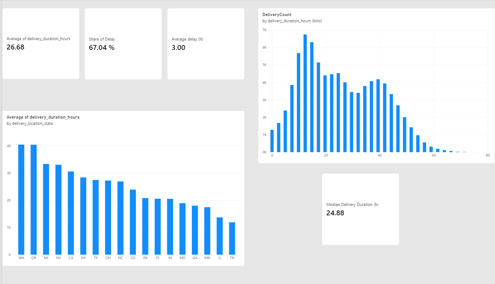
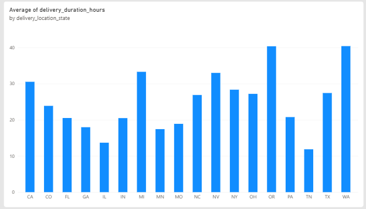
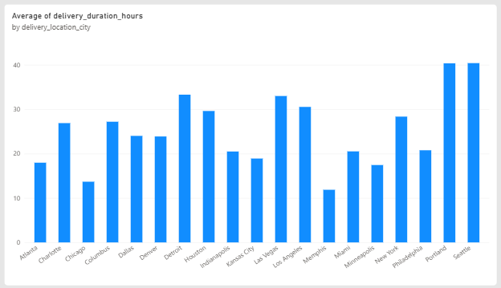

# Dashboard: Delivery Performance

An interactive Power BI dashboard visualizing the core delivery performance
KPIs from [`01_delivery_performance.ipynb`](../../notebooks/01_delivery_performance.ipynb).

## Data Source

Built on `data/processed/clean_delivery_performance.csv`, the output of
[`src/delivery_pipeline.py`](../../src/delivery_pipeline.py). No additional
transformations beyond what the pipeline already does.

## What's in the Dashboard

- **KPI cards:** average delivery duration, share of delayed deliveries
- **Delivery duration by region** (bar chart)
- **State -> city drill-down** on delivery duration, for a closer look at
  regions that stand out in the notebook analysis (e.g. NY, WA)

## Screenshots

*Overview: average delivery duration, delay rate, and regional breakdown.*

Regional drill-down

## Opening the Dashboard

Requires [Power BI Desktop](https://powerbi.microsoft.com/desktop/) (free).
Open [`delivery_performance.pbix`](delivery_performance.pbix) directly -
it reads from the CSV above, so run the ETL pipeline first if the file
doesn't exist yet (see main [README](../../README.md#getting-started)).

## Status

🟡 Early version. Covers the same core KPIs as `01_delivery_performance.ipynb`.
Dashboards for other notebooks will live in their own subfolders - see the
[dashboard index](../README.md) for the full list.