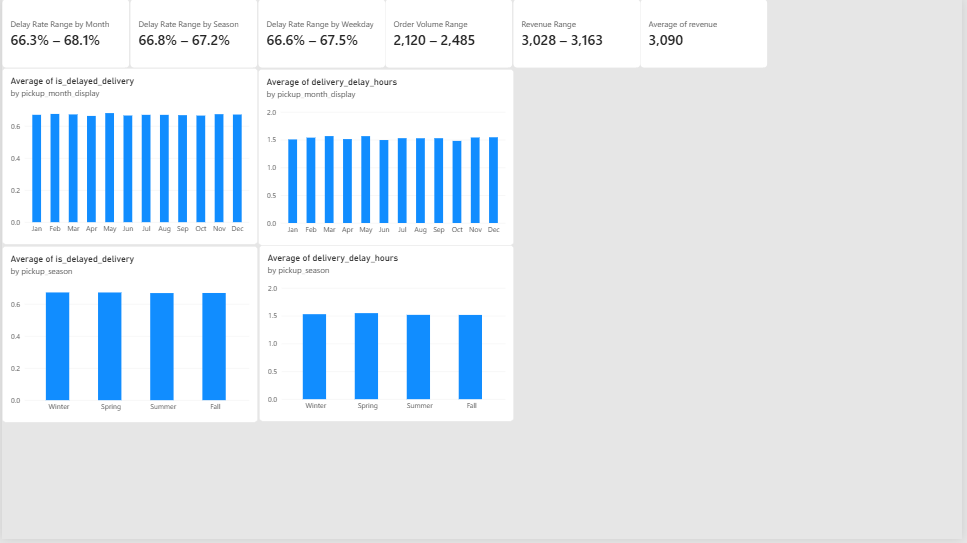
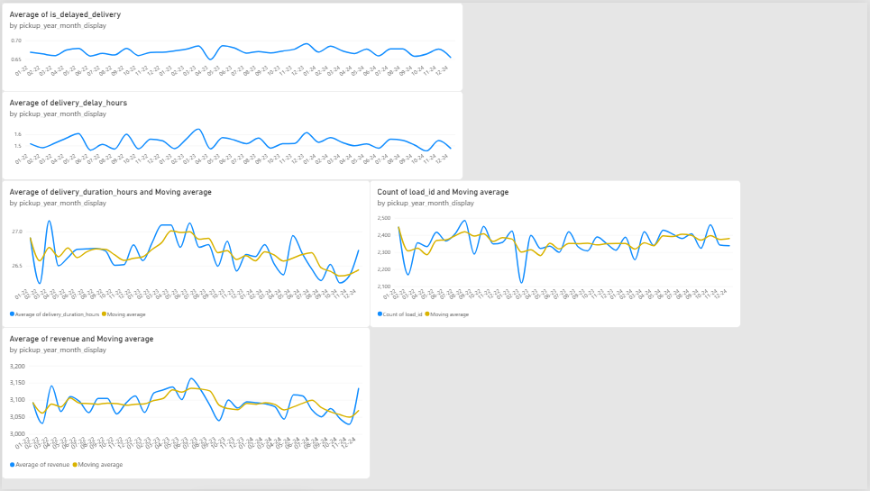
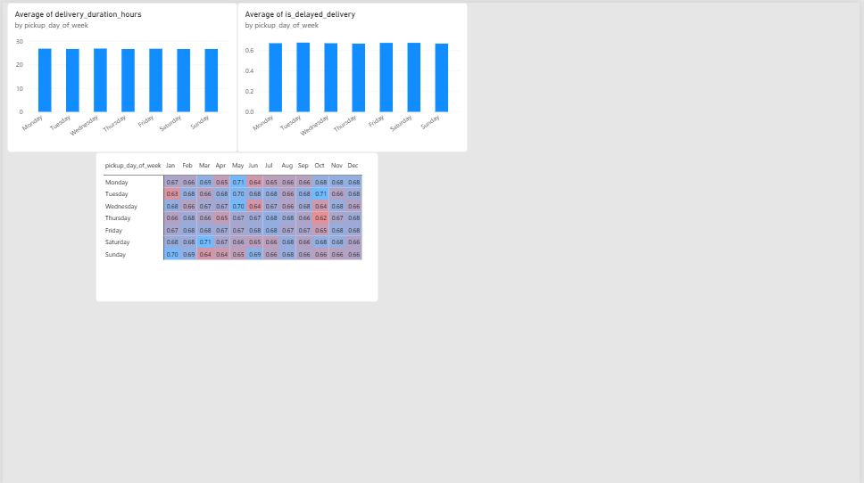

# Dashboard: Temporal Patterns

An interactive Power BI dashboard visualizing the temporal delivery
performance patterns from [`02_temporal_patterns.ipynb`](../../notebooks/02_temporal_patterns.ipynb).

## Data Source

Built on `data/processed/clean_temporal_patterns.csv`, the output of
[`src/delivery_pipeline.py`](../../src/delivery_pipeline.py) (run with
`include_routes=False`). Temporal features not present in the raw pipeline
output (month, season, weekday, and year-month groupings, plus their
display/sort-friendly variants) are derived directly in Power Query,
mirroring the feature engineering done in the notebook.

## What's in the Dashboard

**Page 1 - Overview**
- **KPI cards:** delay rate range and average delay range across month,
  season, and weekday; order volume range; revenue range and average
- **Delay rate and average delay by month** (bar charts)
- **Delay rate and average delay by season** (bar charts)

**Page 2 - Trends over Time**
- **Delay rate and average delay by year-month** (bar charts)
- **Delivery duration, order volume, and revenue by year-month**, each
  with a 3-month rolling average overlay (line charts)

**Page 3 - Weekdays**
- **Delivery duration and delay rate by weekday** (bar charts)
- **Weekday x month heatmap** of delay rate, highlighting whether any
  weekday consistently over- or under-performs within specific months

## Screenshots

*Page 1: KPI cards and delay patterns by month and season.*

Trends over time & weekday breakdown

## Opening the Dashboard

Requires [Power BI Desktop](https://powerbi.microsoft.com/desktop/) (free).
Open [`temporal_patterns.pbix`](temporal_patterns.pbix) directly, it reads
from the CSV above, so run the ETL pipeline first (with
`include_routes=False`, see [`02_temporal_patterns.ipynb`](../../notebooks/02_temporal_patterns.ipynb))
if the file doesn't exist yet.

## Status

## Status

🟢 Finished. Covers the temporal findings from `02_temporal_patterns.ipynb`
across month, season, year-month, and weekday granularities, plus order
volume and revenue trends. Dashboards for other notebooks will live in
their own subfolders - see the [dashboard index](../README.md) for the
full list.