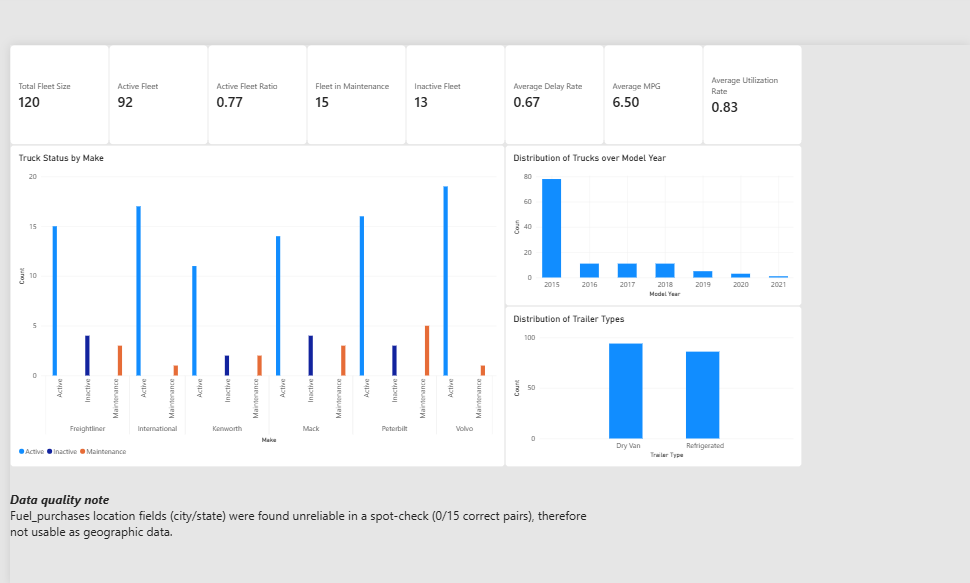
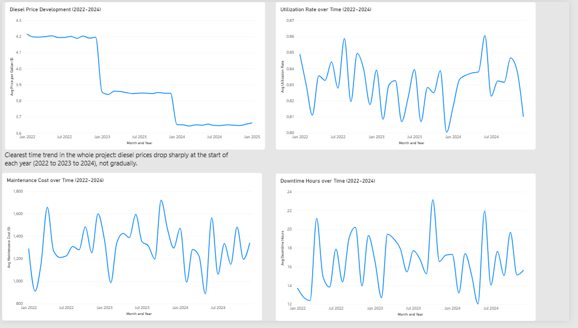
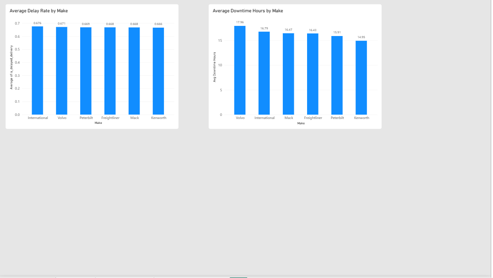

# Dashboard: Fleet & Equipment Analysis

An interactive Power BI dashboard visualizing the fleet and equipment findings
from [`03_fleet_equipment_analysis.ipynb`](../../notebooks/03_fleet_equipment_analysis.ipynb).

## Data Source

Built on `data/processed/clean_fleet_analysis.csv`, the output of
[`src/delivery_pipeline.py`](../../src/delivery_pipeline.py) (run with
`include_fleet=True, include_routes=False`). Two additional tables are loaded
directly from `data/raw/` rather than through the pipeline, since they have a
different grain than the load-level output: `fuel_purchases.csv` (one row per
fuel transaction) and `truck_utilization_metrics.csv` (one row per truck per
month). Features not present in the raw pipeline output (e.g. the
`<=2015`/`>2015` truck age grouping) are derived directly in Power Query,
mirroring the feature engineering done in the notebook.

## What's in the Dashboard

**Page 1 - Overview**
- **KPI cards:** total trucks, active trucks, average delay rate, average MPG,
  average utilization rate
- **Fleet composition:** trucks by make and status, model year distribution,
  trailer type split (bar charts)

**Page 2 - Trends over Time**
- **Diesel price per gallon over time** (line chart), the clearest time trend
  found across the whole project
- **Utilization rate, maintenance cost, and downtime hours over time**
  (line charts)

**Page 3 - Equipment & Downtime**
- **Delay rate by truck make** (bar chart), kept concise since equipment
  characteristics show minimal association with delivery performance
- **Downtime hours by truck make** (bar chart), the one metric where a
  statistically significant truck-level effect was found (permutation test,
  p = 0.0087)

## Screenshots

*Page 1: KPI cards and fleet composition.*

Trends over time & equipment breakdown

## Opening the Dashboard

Requires [Power BI Desktop](https://powerbi.microsoft.com/desktop/) (free).
Open [`fleet_analysis.pbix`](fleet_analysis.pbix) directly, it reads from the
files above, so run the ETL pipeline first (with `include_fleet=True,
include_routes=False`, see
[`03_fleet_equipment_analysis.ipynb`](../../notebooks/03_fleet_equipment_analysis.ipynb))
if `clean_fleet_analysis.csv` doesn't exist yet.

## Status

🟢 Finished. Covers the fleet and equipment findings from
`03_fleet_equipment_analysis.ipynb`: fleet composition, diesel price and
utilization trends, and the equipment/downtime comparison. Dashboards for
other notebooks will live in their own subfolders - see the
[dashboard index](../README.md) for the full list.